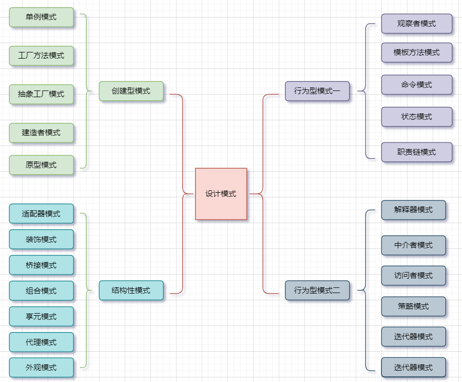

## 何为设计模式
设计模式是一套被反复使用的、经过分类编目的、代码设计经验的总结。
> 设计模式的概念主要在 1994 年出版的书籍《设计模式：可复用面向对象的软件的基础》中提出，
> 作者GoF（即Erich Gamma、Richard Helm、Ralph Johnson 和 John Vlissides 四人）

## 设计模式分类

GoF提出的设计模式大体上可进行如下划分

## 设计模式的原则
  - 开闭原则

对扩展开放，对修改关闭

  - 里氏代换原则

里氏代换原则是面向对象设计的基本原则之一。 里氏代换原则中说，任何基类可以出现的地方，子类一定可以出现

  - 依赖倒转原则

依赖于抽象而不依赖于具体

  - 接口隔离原则

依赖于抽象而不依赖于具体

  - 迪米特法则，又称最少知道原则

一个实体应当尽量少地与其他实体之间发生相互作用，使得系统功能模块相对独立。

  - 合成复用原则

尽量使用合成/聚合的方式，而不是使用继承。